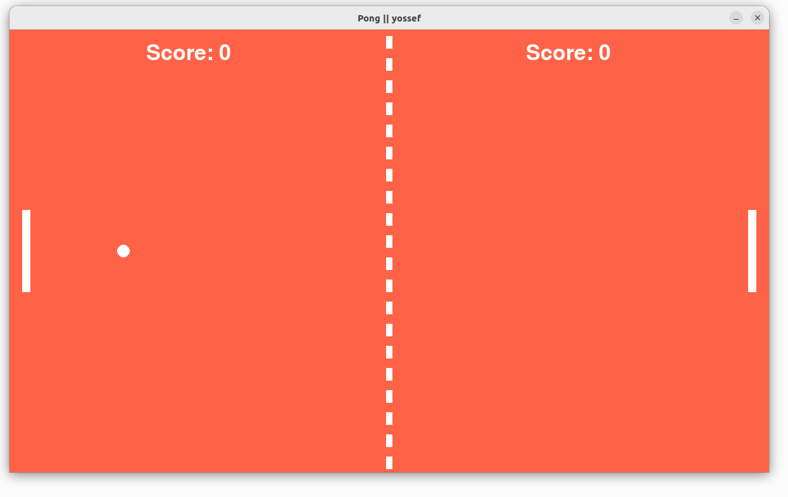

<!-- title -->
<h1 align="center">ping pong || yossef</h1>


``````

### 📝 Table of Contents

🎮 The Pong game code is written in Python using the Pygame module to create the game.

🏓 The game consists of two paddles that players can control using the keyboard.
The objective is to prevent the ball from hitting your side while trying to make it hit the opponent's side.

❗ The code starts by importing the necessary modules, including pygame for game development
. It then initializes pygame and sets up the game window.

🎨 The code defines color constants using RGB values to draw different elements of the game,
 such as paddles, the ball, and the background.

⏰ The clock variable is created to limit the frame rate to 60 frames per second.

🖥️ The paddle class is defined, representing the paddles in the game. Each paddle has attributes such as position,
size, and velocity. The class also includes methods for drawing the paddles on the screen and handling their
 movement based on player input.

⚽ The ball class is defined to represent the ball in the game. It has attributes such as position,
radius, and velocities in the x and y directions. Similar to the paddle class, it includes methods
for drawing the ball on the screen and updating its position.

🚀 The handle_collisions() function checks for collisions between the ball and the paddles. If a
collision occurs, the ball's velocity and direction are changed accordingly.

💯 The code keeps track of the players' scores using variables left_score and right_score. A score()
function is responsible for rendering the scores on the screen.

🎮 The main() function is the entry point of the game. It sets up the game loop, handles player input,
updates the game state, and renders the game objects on the screen.

🏆 The code checks for game-winning conditions. If a player reaches a certain score, they are
declared the winner, and the game is reset.

💡 Overall, this code provides a comprehensive implementation of the classic Pong game.
It covers player controls, collision detection, scoring, and rendering graphics on the screen.

``````


---
### Email : 📧 
```
yossefsabry66@gmail.com
```````

